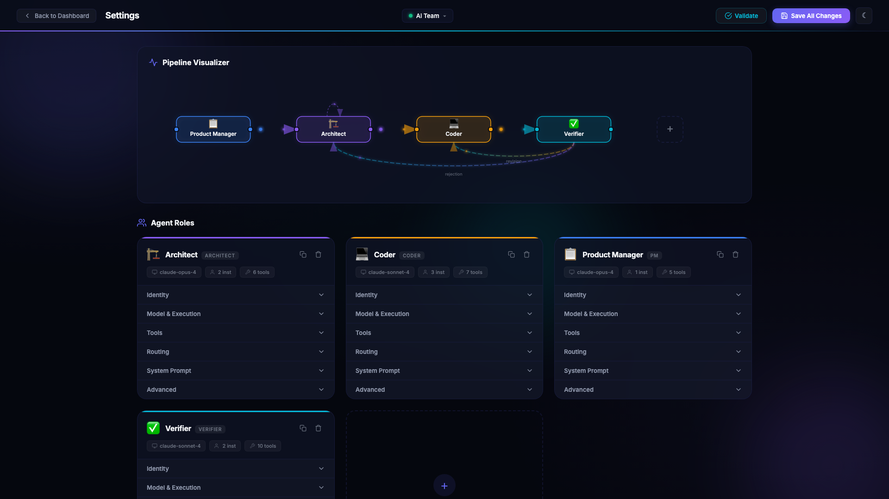
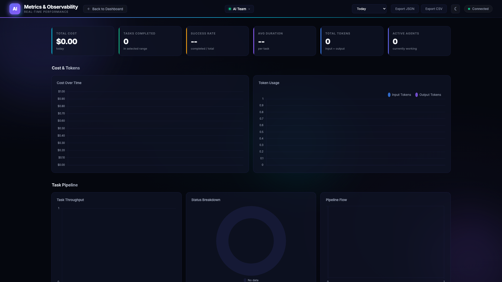

<p align="center">
  <h1 align="center">TaskBrew</h1>
  <p align="center">
    <strong>Multi-agent AI team orchestrator</strong><br>
    Coordinate Claude Code, Gemini CLI, and custom AI agents into collaborative development workflows.
  </p>
  <p align="center">
    <a href="LICENSE"></a>
    <a href="https://www.python.org/downloads/"></a>
    
    
    
  </p>
</p>

---

<p align="center">
  
</p>

## What is TaskBrew?

TaskBrew turns AI coding agents into a coordinated software team. You define roles -- Product Manager, Architect, Coder, Verifier -- each with a system prompt, tools, and routing rules. TaskBrew handles the rest: task decomposition, dependency resolution, parallel execution, code review, and verification. Everything is driven by a shared task board backed by SQLite.

Each agent runs as an independent loop that polls for work matching its role, executes using a real CLI provider (Claude Code or Gemini CLI), and routes results downstream. The PM decomposes goals into architecture tasks, the Architect produces implementation plans, Coders write code in isolated git worktrees, and Verifiers run tests and review the output. The entire pipeline is **config-driven** -- no Python code changes needed to add roles, swap providers, or wire in new MCP tool servers.

### How it works

```
  You submit a goal
       |
       v
  +----+-----+     decomposes into      +----------+
  |    PM     | ───────────────────────> | Architect|
  | (Claude)  |     architecture tasks   | (Claude) |
  +----------+                           +----+-----+
                                              |
                                    creates coder tasks
                                              |
                    +-------------------------+-------------------------+
                    |                         |                         |
              +-----+-----+           +------+----+            +------+----+
              |  Coder-1   |           |  Coder-2  |            |  Coder-3  |
              | (Sonnet)   |           | (Sonnet)  |            | (Sonnet)  |
              |  worktree  |           |  worktree |            |  worktree |
              +-----+------+          +-----+-----+            +-----+-----+
                    |                        |                        |
                    +----------+-------------+------------------------+
                               |
                         +-----+------+       rejection
                         |  Verifier  | ─ ─ ─ ─ ─ ─ ─> back to Coder
                         |  (Claude)  |
                         +-----+------+
                               |
                           approval
                               |
                           merged
```

---

## Screenshots

<table>
<tr>
<td width="50%">

**Pipeline Visualizer** -- Visual routing graph showing how roles connect. Configure agents, models, tools, and routing from the Settings page.


</td>
<td width="50%">

**Metrics & Observability** -- Track costs, tokens, task throughput, success rates, and pipeline flow in real time. Export data as JSON or CSV.


</td>
</tr>
</table>

---

## Features

### Core Orchestration

- **Role-based agents** -- Define any number of roles (PM, Architect, Coder, Verifier, or custom) with system prompts, tools, and routing rules via YAML
- **Task state machine** -- Full lifecycle: `pending` → `in_progress` → `completed`/`failed`/`rejected`, with `blocked` for dependency management
- **Dependency resolution** -- Tasks can declare `blocked_by` dependencies; blocked tasks auto-unblock when dependencies complete, failures cascade downstream
- **Priority-based claiming** -- Agents claim the highest-priority pending task matching their role (critical > high > medium > low)
- **Task groups** -- Organize related tasks into groups with auto-generated prefixed IDs (FEAT-001, DEBT-002)
- **Hybrid routing** -- Open mode (agents see all available roles) and restricted mode (agents only route to declared targets)
- **Rejection loops** -- Verifiers can reject work back to Coders with feedback; cycle detection prevents infinite loops

### Agent System

- **Multi-provider support** -- Built-in Claude Code SDK and Gemini CLI integration; add custom providers via YAML or Python
- **Auto-scaling** -- Spawn/remove agent instances based on pending task queue depth, with configurable thresholds and cooldowns
- **Git worktree isolation** -- Each Coder agent works in an isolated worktree on a feature branch, never touching the main checkout
- **Heartbeat monitoring** -- Agents send heartbeats every 15s; stale agents are detected and their tasks recovered automatically
- **Retry with backoff** -- Transient failures retry up to 3 times with exponential backoff
- **Orphan recovery** -- On startup, in-progress tasks from crashed sessions are automatically reset to pending

### Intelligence (33 modules)

TaskBrew ships with 33 built-in intelligence modules that enhance agent behavior:

| Category | Modules |
|----------|---------|
| **Quality & Review** | Quality management, verification, review learning, compliance |
| **Planning & Execution** | Advanced planning, preflight checks, impact analysis, checkpoints |
| **Code Analysis** | Code intelligence, code reasoning, knowledge graph (AST-based) |
| **Collaboration** | Messaging, coordination, social intelligence, collaboration |
| **Learning** | Memory manager, learning, self-improvement, knowledge management |
| **Security** | Security intelligence (vulnerability scanning, secret detection, SAST) |
| **Observability** | Observability, process intelligence, escalation monitoring |
| **Autonomy** | Autonomous decision-making, task intelligence, specialization |

### Web Dashboard

- **Real-time task board** -- Kanban columns (Blocked, Pending, In Progress, Completed, Rejected) with drag-and-drop, filters, and search
- **Agent sidebar** -- Live agent status, current task, tool call streaming, and direct chat with any agent
- **Pipeline visualizer** -- Visual graph of role routing with interactive configuration
- **Metrics page** -- Cost tracking, token usage, task throughput, success rates, and pipeline flow charts
- **Settings page** -- Configure roles, models, tools, routing, guardrails, and auto-scaling from the UI
- **Dark mode** -- Full dark theme with WebSocket-powered live updates
- **170+ API endpoints** -- Full REST API with OpenAPI docs at `/docs`
- **Export** -- Download task data, metrics, and reports as JSON or CSV

### DevOps & Safety

- **Task guardrails** -- Configurable max task depth (default 10), per-group task caps (default 50), and rejection cycle limits (default 3)
- **Cost management** -- Per-task token/cost tracking with budget limits at global, role, and group scopes
- **Webhook integration** -- Register webhooks for task events with HMAC-SHA256 signatures, retry logic, and IP whitelisting
- **Notifications** -- In-app notification system triggered by task completion, failures, budget warnings, and escalations
- **Authentication** -- Optional token-based auth with rate limiting, lockout, and per-request verification
- **Docker deployment** -- Multi-stage Dockerfile with non-root user, resource limits, health checks, and docker-compose
- **Plugin system** -- Drop Python files into `plugins/` to hook into lifecycle events, add API routes, or register custom tools
- **Multi-project support** -- Register and switch between multiple projects from a single instance
- **Event bus** -- Async pub/sub with wildcard subscriptions and 10,000-event history

---

## Quick Start

### Prerequisites

- Python 3.10+
- At least one CLI agent: [Claude Code](https://docs.anthropic.com/en/docs/claude-code) or [Gemini CLI](https://github.com/google-gemini/gemini-cli)
- An API key (`ANTHROPIC_API_KEY` or `GOOGLE_API_KEY`)

### Install and run

```bash
# Install from PyPI
pip install taskbrew

# Initialize a new project
taskbrew init --name my-project

# Set your API key
export ANTHROPIC_API_KEY="sk-ant-..."

# Check your setup
taskbrew doctor

# Start the orchestrator + dashboard
taskbrew start
```

Open [http://localhost:8420](http://localhost:8420) to access the dashboard.

### Submit your first goal

From the dashboard UI, type a goal in the input bar and click **Submit Goal**. Or use the CLI:

```bash
taskbrew goal "Build a REST API for user management" \
  --description "JWT auth, CRUD endpoints, SQLite storage, full test coverage"
```

The PM agent will decompose this into architecture tasks, the Architect will create implementation plans, Coders will write code in isolated branches, and the Verifier will review and merge.

### Monitor progress

```bash
# CLI status
taskbrew status

# Or watch the dashboard at http://localhost:8420
```

---

## Architecture

```
                    +-----------------------+
                    |   Web Dashboard       |
                    |   FastAPI + WebSocket |
                    |   170+ API endpoints  |
                    +-----------+-----------+
                                |
                    +-----------+-----------+
                    |      Orchestrator     |
                    |  +-----------------+  |
                    |  | Task Board      |  |
                    |  | Event Bus       |  |
                    |  | Database (SQLite)|  |
                    |  | Plugin Registry |  |
                    |  | 33 Intel Modules|  |
                    |  +-----------------+  |
                    +-----------+-----------+
                                |
              +---------+-------+-------+---------+
              |         |               |         |
        +-----+---+  +-+-------+  +----+----+  +-+-------+
        |   PM    |  |Architect|  | Coder x3|  |Verifier |
        | Opus    |  | Opus    |  | Sonnet  |  | Opus    |
        +---------+  +---------+  +---------+  +---------+
              |         |               |         |
        +-----+---------+---------------+---------+-----+
        |           Provider Abstraction Layer           |
        |     Claude SDK  |  Gemini CLI  |  Custom      |
        +---------------------------------------------------+
```

### Task lifecycle

```
  pending ──(agent claims)──> in_progress ──> completed
     ^                            |
     |                       +---------+
     |                       |         |
  (unblocked)             failed    rejected
     |                       |         |
  blocked <──(deps)──────────+    (back to coder)
```

Tasks move through a state machine. Dependencies are resolved automatically: when a task completes, all tasks blocked by it are unblocked. When a task fails, failure cascades to all downstream dependents.

---

## Configuration

All configuration lives in `config/`:

| Path | Purpose |
|------|---------|
| `config/team.yaml` | Team settings: database, dashboard, MCP servers, guardrails, auto-scaling |
| `config/roles/*.yaml` | Agent role definitions: system prompt, tools, model, routing |
| `config/providers/*.yaml` | CLI provider definitions: binary, flags, output parser |
| `plugins/` | Python plugins for lifecycle hooks and custom API routes |
| `.env` | API keys and environment overrides (see `.env.example`) |

### team.yaml

```yaml
team_name: "My Project"

database:
  path: "~/.taskbrew/data/my-project.db"

dashboard:
  host: "0.0.0.0"
  port: 8420

# Wire in any MCP tool server
mcp_servers:
  github:
    command: "npx"
    args: ["-y", "@modelcontextprotocol/server-github"]
    env:
      GITHUB_TOKEN: "${GITHUB_TOKEN}"

# Prevent runaway agent behavior
guardrails:
  max_task_depth: 10
  max_tasks_per_group: 50
  rejection_cycle_limit: 3
```

### Role definition

```yaml
# config/roles/coder.yaml
role: coder
display_name: "Coder"
prefix: "CD"
color: "#f59e0b"
emoji: "\U0001F4BB"

system_prompt: |
  You are a Software Engineer. Write clean, tested code.

tools: [Read, Write, Edit, Bash, Glob, Grep, mcp__task-tools__create_task]
model: claude-sonnet-4-6

accepts: [implementation, bug_fix, revision]
routes_to:
  - role: verifier
    task_types: [verification]

max_instances: 3
auto_scale:
  enabled: true
  scale_up_threshold: 3
  scale_down_idle: 15
```

See [docs/configuration.md](docs/configuration.md) for the full reference.

---

## Extending TaskBrew

### Add a new role

Create a YAML file in `config/roles/` and restart:

```yaml
# config/roles/security-reviewer.yaml
role: security_reviewer
display_name: "Security Reviewer"
prefix: "SR"
emoji: "\U0001F512"
color: "#ef4444"
system_prompt: |
  You are a Security Reviewer. Audit code for vulnerabilities.
tools: [Read, Glob, Grep, Bash, mcp__task-tools__create_task]
model: claude-sonnet-4-6
accepts: [security_review]
routes_to:
  - role: coder
    task_types: [bug_fix]
max_instances: 1
```

### Add an MCP tool server

Declare it in `team.yaml` -- agents automatically get access:

```yaml
mcp_servers:
  postgres:
    command: "python"
    args: ["-m", "mcp_postgres", "--connection-string", "${DATABASE_URL}"]
    env:
      DATABASE_URL: "${DATABASE_URL}"
```

Tool naming convention: `mcp__<server-name>__<tool-name>`.

### Add a CLI provider

For providers beyond Claude and Gemini, create a YAML config:

```yaml
# config/providers/codex.yaml
name: codex
display_name: "OpenAI Codex CLI"
binary: codex
detect_models: ["codex-*", "gpt-4o-*"]
command_template:
  prompt_flag: "--prompt"
  model_flag: "--model"
```

Or subclass `ProviderPlugin` in Python for full SDK control. See [docs/extending.md](docs/extending.md).

### Write a plugin

Drop a Python file into `plugins/`:

```python
# plugins/slack_notify.py
from taskbrew.plugin_system import PluginMetadata

def register(registry):
    registry.register_plugin(PluginMetadata(
        name="slack-notify",
        version="1.0.0",
        description="Slack notifications on task events",
    ))
    registry.register_hook("task.completed", on_task_completed, plugin_name="slack-notify")

async def on_task_completed(data):
    task_id = data.get("task_id")
    # Send Slack notification, update Jira, etc.
```

Plugins can also register API routes and custom tools. See [docs/extending.md](docs/extending.md).

---

## CLI Reference

| Command | Description |
|---------|-------------|
| `taskbrew init --name <name>` | Scaffold a new project with config directory and default roles |
| `taskbrew start` | Start the orchestrator, agent loops, and dashboard |
| `taskbrew serve --project-dir <path>` | Start with explicit project directory |
| `taskbrew goal "<title>" --description "<desc>"` | Submit a new goal for the PM to decompose |
| `taskbrew status` | Show agent status, active groups, and task counts |
| `taskbrew doctor` | Verify Python version, CLI binaries, API keys, and config files |

---

## Docker Deployment

```bash
# Copy and fill in your API key
cp .env.example .env

# Start with Docker Compose
docker compose up -d
```

The container runs as a non-root user with resource limits (2 CPU, 4GB RAM), health checks, log rotation, and persistent volumes for data and artifacts.

```yaml
# docker-compose.yaml (excerpt)
services:
  taskbrew:
    build: .
    ports: ["8420:8420"]
    restart: always
    volumes:
      - ./data:/app/data
      - ./artifacts:/app/artifacts
      - ./config:/app/config
    environment:
      - ANTHROPIC_API_KEY=${ANTHROPIC_API_KEY}
```

---

## API

TaskBrew exposes 170+ REST endpoints with full OpenAPI documentation.

When the server is running, visit:
- **Swagger UI**: [http://localhost:8420/docs](http://localhost:8420/docs)
- **ReDoc**: [http://localhost:8420/redoc](http://localhost:8420/redoc)

Key endpoint groups:

| Group | Examples |
|-------|---------|
| **Tasks** | `POST /api/tasks`, `GET /api/board`, `POST /api/tasks/{id}/complete` |
| **Agents** | `GET /api/agents`, `POST /api/agents/{role}/pause` |
| **Intelligence** | `GET /api/intelligence/quality/report`, `POST /api/intelligence/memory/store` |
| **Metrics** | `GET /api/metrics/costs`, `GET /api/metrics/usage` |
| **System** | `GET /api/health`, `GET /api/projects`, `POST /api/projects/activate` |
| **WebSocket** | `ws://localhost:8420/ws` for real-time event streaming |

---

## Development

```bash
git clone https://github.com/nikhilchatragadda/taskbrew.git
cd taskbrew
pip install -e ".[dev]"

# Run tests (1300+ tests)
pytest tests/ -x

# Run with coverage
pytest tests/ --cov=taskbrew --cov-report=term-missing

# Lint
ruff check src/ tests/

# Security scan
bandit -r src/taskbrew/
```

### Project structure

```
src/taskbrew/
  main.py                # CLI entry point and orchestrator bootstrap
  config_loader.py       # YAML config parsing and validation
  project_manager.py     # Multi-project registry and lifecycle
  plugin_system.py       # Plugin registry, hooks, and event wiring
  auth.py                # Token-based authentication and rate limiting
  agents/
    agent_loop.py        # Poll/claim/execute/complete cycle
    auto_scaler.py       # Dynamic instance scaling
    provider.py          # Multi-provider detection and dispatch
    provider_base.py     # Abstract base for custom providers
  orchestrator/
    task_board.py        # Task CRUD, state machine, dependency resolution
    database.py          # SQLite schema and migrations
    event_bus.py         # Async pub/sub with wildcard support
    cost_manager.py      # Budget tracking and enforcement
    notification_service.py
    webhook_manager.py
  dashboard/
    app.py               # FastAPI application factory
    routers/             # 14 router modules (tasks, agents, intelligence, etc.)
    templates/           # Jinja2 HTML templates
    static/              # CSS and JavaScript assets
  intelligence/          # 33 intelligence modules
  tools/
    task_tools.py        # Built-in MCP task server
    intelligence_tools.py # Built-in MCP intelligence server
    worktree_manager.py  # Git worktree creation and cleanup
```

---

## Event Bus

All components communicate through an async event bus. Subscribe to events for custom integrations:

```python
# Subscribe to task completions
event_bus.subscribe("task.completed", my_handler)

# Subscribe to ALL events
event_bus.subscribe("*", my_handler)

# Emit custom events from plugins
await event_bus.emit("my_plugin.alert", {"severity": "warning", "message": "..."})
```

Key events: `task.completed`, `task.failed`, `task.claimed`, `agent.status_changed`, `agent.result`, `tool.pre_use`, `tool.post_use`.

---

## Contributing

See [CONTRIBUTING.md](CONTRIBUTING.md) for development setup, testing guidelines, code style, and pull request workflow.

## Documentation

- [Getting Started](docs/getting-started.md) -- Installation, initialization, first task
- [Configuration Reference](docs/configuration.md) -- Every field in team.yaml and role YAML
- [Architecture Overview](docs/architecture.md) -- System internals, task lifecycle, agent execution
- [Extending TaskBrew](docs/extending.md) -- Add roles, providers, plugins, MCP tools

## License

[MIT](LICENSE) -- Copyright (c) 2026 Nikhil Chatragadda
