# TaskBrew System Design Diagrams

This document captures the current TaskBrew architecture as Mermaid diagrams.
It is intended to be the high-level and low-level system map for developers,
operators, and future design work.

The diagrams reflect the current `main` implementation, including the
per-project system agent, backlog and review gates, work packages, package
review, and durable merge queue.

## Source Map

Primary source modules:

- Runtime entrypoint: `src/taskbrew/main.py`
- Project registry and scaffolding: `src/taskbrew/project_manager.py`
- Dashboard app and routers: `src/taskbrew/dashboard/`
- Agent runtime: `src/taskbrew/agents/`
- Orchestrator services: `src/taskbrew/orchestrator/`
- Intelligence managers: `src/taskbrew/intelligence/`
- MCP tools: `src/taskbrew/tools/`
- Model catalog and provider defaults: `src/taskbrew/model_catalog.py`
- Project configuration: `config/team.yaml`, `config/roles/*.yaml`, `pipelines/*.yaml`

---

## 1. High-Level System Context

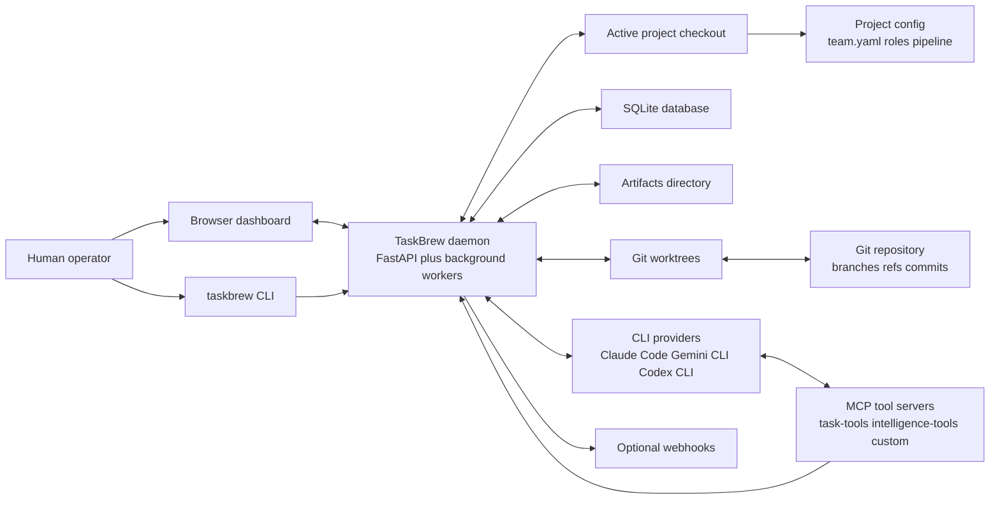

TaskBrew is primarily a local orchestration daemon. The dashboard and CLI are
control surfaces; the daemon owns the project lifecycle, task board,
background workers, agent processes, system gate analysis, and branch
integration.

---

## 2. High-Level Container Architecture

```mermaid
flowchart TB
    subgraph Control["Control Plane"]
        CLI["CLI commands<br/>start serve goal status init doctor"]
        Dashboard["FastAPI dashboard<br/>HTML CSS JS APIs WebSockets"]
        ProjectManager["ProjectManager<br/>registry activation scaffolding"]
    end

    subgraph Core["Orchestrator Container"]
        Orchestrator["Orchestrator<br/>shared runtime container"]
        TaskBoard["TaskBoard<br/>groups tasks packages dependencies"]
        EventBus["EventBus<br/>in-process pub-sub"]
        DB["Database<br/>SQLite aiosqlite migrations"]
        InstanceManager["InstanceManager<br/>agent state heartbeats"]
        ArtifactStore["ArtifactStore<br/>task outputs and files"]
        Memory["Memory and context providers"]
        Intelligence["Intelligence managers<br/>quality planning security observability"]
        Plugins["PluginRegistry"]
    end

    subgraph Workers["Background Workers"]
        AgentLoops["AgentLoop instances<br/>PM Architect Coder optional roles"]
        SystemGates["SystemGateManager<br/>backlog review package review"]
        MergeBroker["MergeBroker<br/>serialized branch integration"]
        AutoScaler["AutoScaler<br/>role instance scaling"]
        Recovery["Orphan recovery<br/>stale agents stuck blockers"]
        Escalation["Escalation monitor"]
    end

    subgraph Execution["Execution Plane"]
        ProviderLayer["Provider abstraction"]
        Claude["Claude Code"]
        Gemini["Gemini CLI"]
        Codex["Codex CLI"]
        MCPTools["MCP tools"]
        WorktreeManager["WorktreeManager"]
        GitRepo["Git repository"]
    end

    subgraph Persistence["Persistent State"]
        SQLiteFile["Project SQLite DB"]
        ArtifactsDir["Artifacts"]
        WorktreeDir[".worktrees"]
        Registry["~/.taskbrew/projects.yaml"]
        ConfigFiles["config and pipeline YAML"]
    end

    CLI --> ProjectManager
    Dashboard --> ProjectManager
    ProjectManager --> Orchestrator
    Orchestrator --> TaskBoard
    Orchestrator --> EventBus
    Orchestrator --> DB
    Orchestrator --> InstanceManager
    Orchestrator --> ArtifactStore
    Orchestrator --> Memory
    Orchestrator --> Intelligence
    Orchestrator --> Plugins
    Orchestrator --> AgentLoops
    Orchestrator --> SystemGates
    Orchestrator --> MergeBroker
    Orchestrator --> AutoScaler
    Orchestrator --> Recovery
    Orchestrator --> Escalation
    AgentLoops --> ProviderLayer
    SystemGates --> ProviderLayer
    ProviderLayer --> Claude
    ProviderLayer --> Gemini
    ProviderLayer --> Codex
    ProviderLayer --> MCPTools
    AgentLoops --> WorktreeManager
    MergeBroker --> GitRepo
    WorktreeManager --> GitRepo
    DB --> SQLiteFile
    ArtifactStore --> ArtifactsDir
    WorktreeManager --> WorktreeDir
    ProjectManager --> Registry
    ProjectManager --> ConfigFiles
```

---

## 3. Runtime Topology

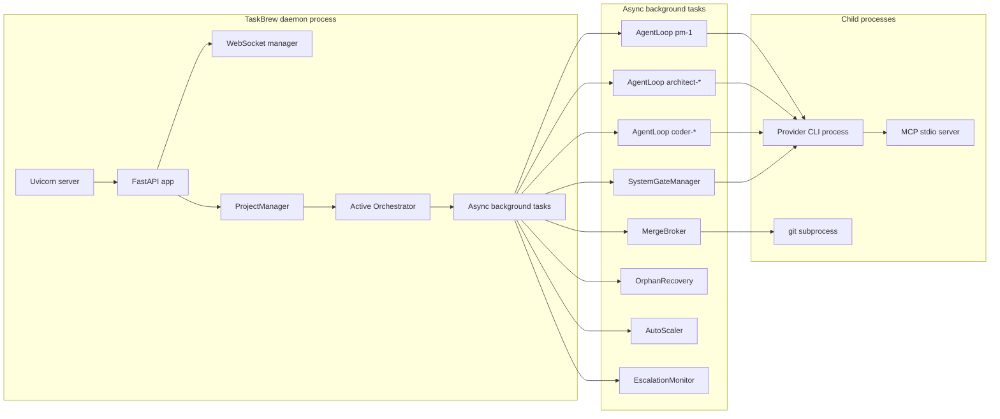

---

## 4. Project Startup and Activation

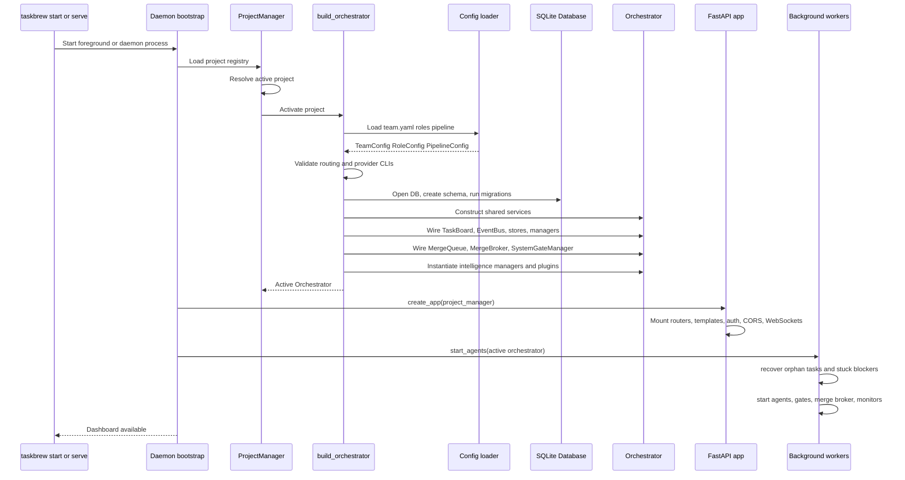

---

## 5. Goal-to-Merge Delivery Flow

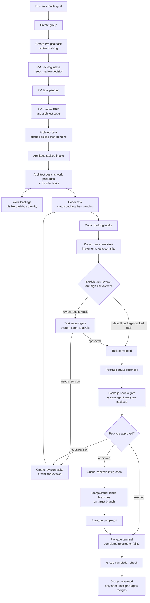

In the default work-package flow, backlog intake does **not** send every
package-backed task through task review. It records `needs_review=false` and
lets the Work Package review gate be the main semantic quality gate. Task-level
review is reserved for explicit `review_scope=task` exceptions.

---

## 6. Task State Machine

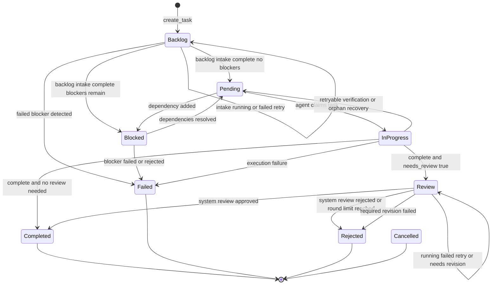

Notes:

- Every newly created task starts in `backlog`.
- `intended_status` stores the state that should follow backlog intake.
- The system agent may set only `needs_review`, `needs_review_reason`, and
  structured decision metadata during backlog intake. For package-backed tasks,
  the default decision is `needs_review=false` because package review is the
  primary gate.
- Review gates are analysis-only. They approve, reject, fail review, or request
  revision work. They do not patch code directly.
- A `needs_revision` outcome creates separate revision tasks. Those tasks start
  in `backlog`; the original review item remains in review until revision work
  resolves it or the review round limit rejects it.

---

## 7. Work Package State Machine

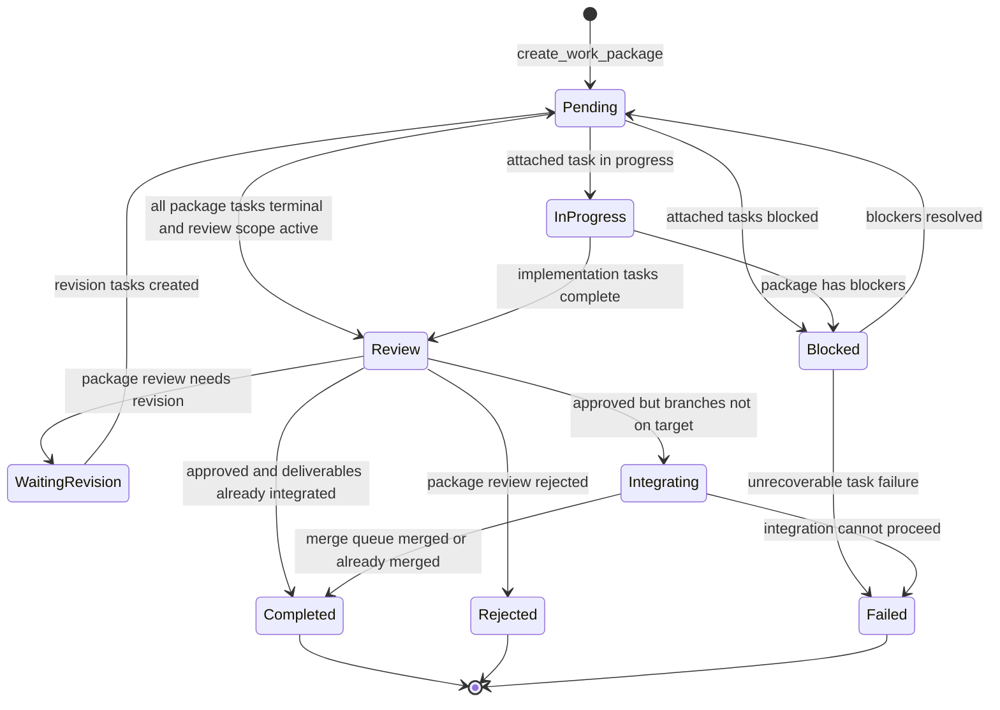

Work packages are first-class dashboard objects. They group related tasks into
reviewable slices and prevent huge goals from waiting for one final goal-level
review.

---

## 8. Agent Task Execution Sequence

```mermaid
sequenceDiagram
    participant Loop as AgentLoop
    participant Board as TaskBoard
    participant Inst as InstanceManager
    participant WT as WorktreeManager
    participant Ctx as Context builders
    participant Runner as AgentRunner
    participant Provider as Provider adapter
    participant CLI as CLI provider
    participant MCP as MCP tools
    participant DB as SQLite
    participant Bus as EventBus

    Loop->>Board: claim_task(role, instance_id)
    Board->>DB: atomic UPDATE pending to in_progress
    Board-->>Loop: claimed task or none
    Loop->>Inst: status working and heartbeat
    Loop->>WT: create isolated worktree if role mutates files
    WT-->>Loop: worktree path and branch
    Loop->>Ctx: build task context
    Ctx->>DB: read parent artifacts, siblings, memory, conventions
    Ctx-->>Loop: full prompt context
    Loop->>Runner: run(prompt, cwd)
    Runner->>Provider: detect provider and build options
    Provider->>CLI: query with model and reasoning settings
    CLI->>MCP: call create_task, complete_task, record_check, ask_question
    MCP->>Board: dashboard API mutation
    Board->>DB: persist task board changes
    Board->>Bus: emit task events
    CLI-->>Provider: stream assistant and result messages
    Provider-->>Runner: normalized output and usage
    Runner-->>Loop: output text
    Loop->>Board: complete_task_with_output or fail_task
    Board->>DB: persist output, review status, dependencies
    Board->>Bus: emit completion or failure events
    Loop->>Inst: status idle
    Loop->>WT: cleanup worktree when appropriate
```

---

## 9. System Gate Sequence

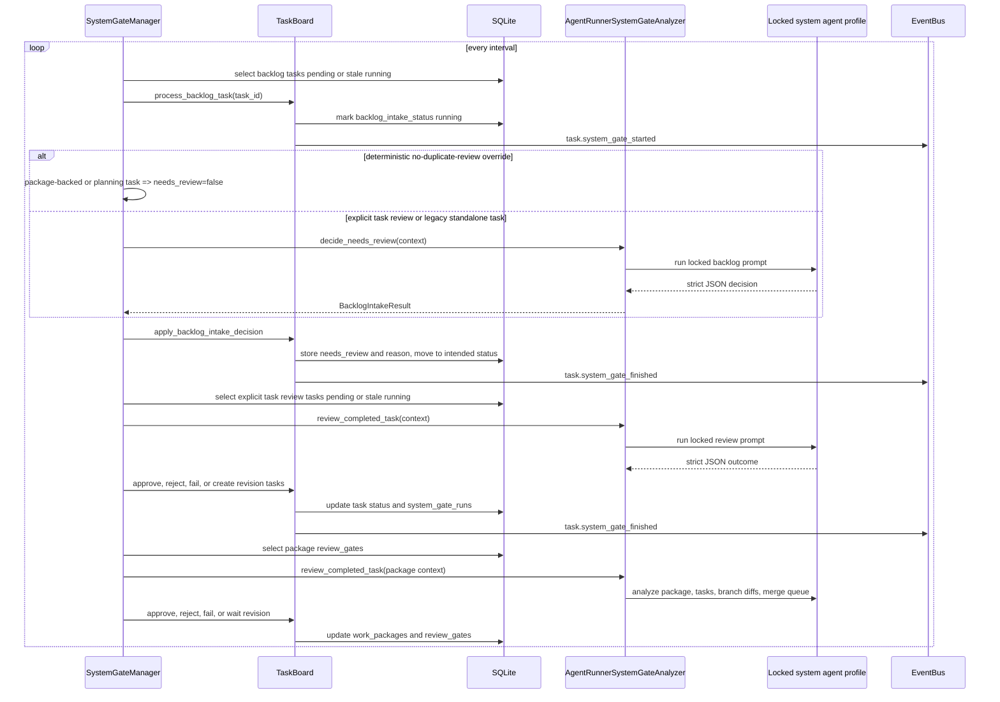

---

## 10. Package Review and Integration Sequence

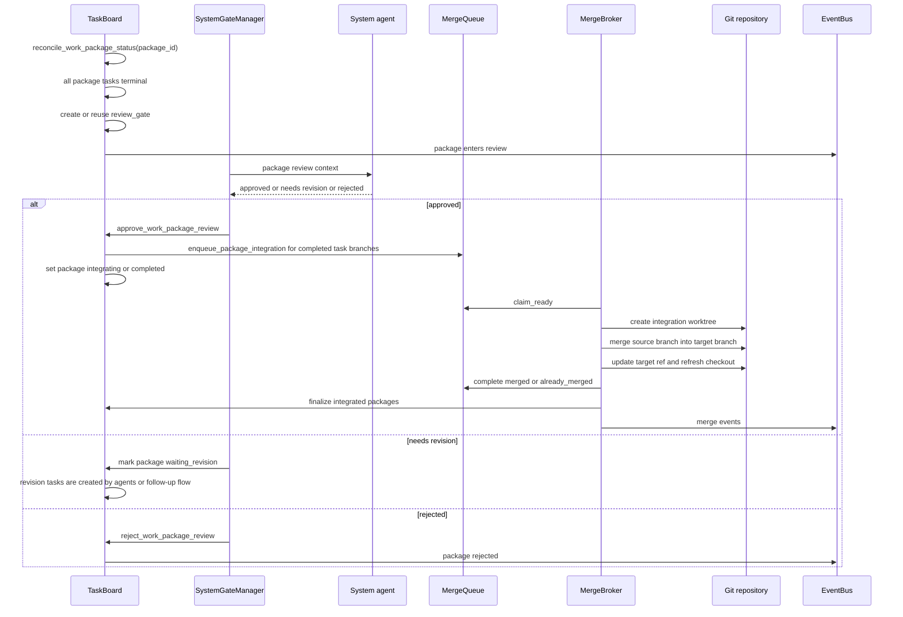

---

## 11. Durable Merge Queue Design

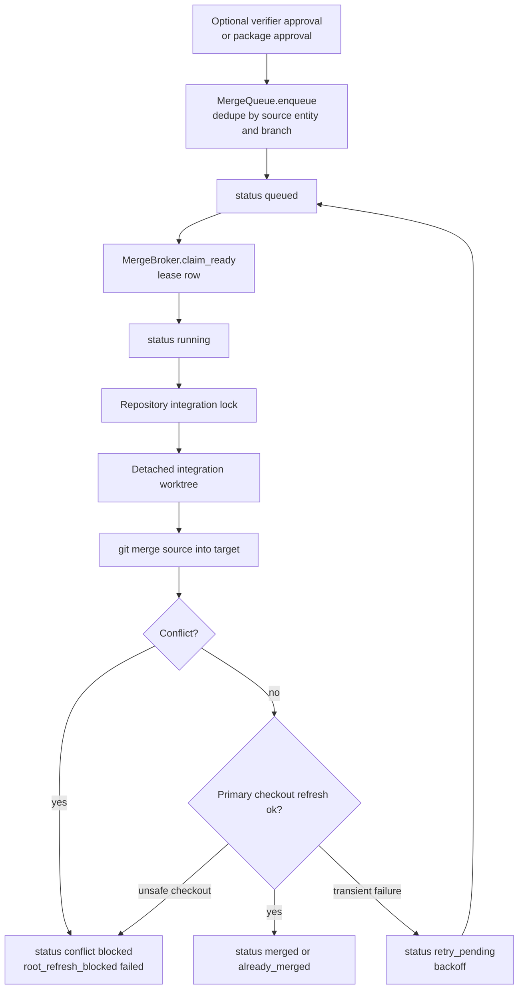

The broker is provider-neutral: agents perform semantic review, but TaskBrew
owns branch integration so provider sandbox differences cannot skip merges.

---

## 12. Dashboard and Realtime Update Flow

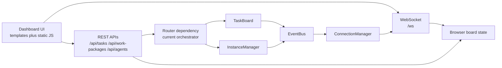

The browser uses REST for initial state and commands, and WebSocket events for
live updates. If WebSocket reconnects, the UI can refresh state through the
REST board endpoints.

---

## 13. Provider, Model, and MCP Wiring

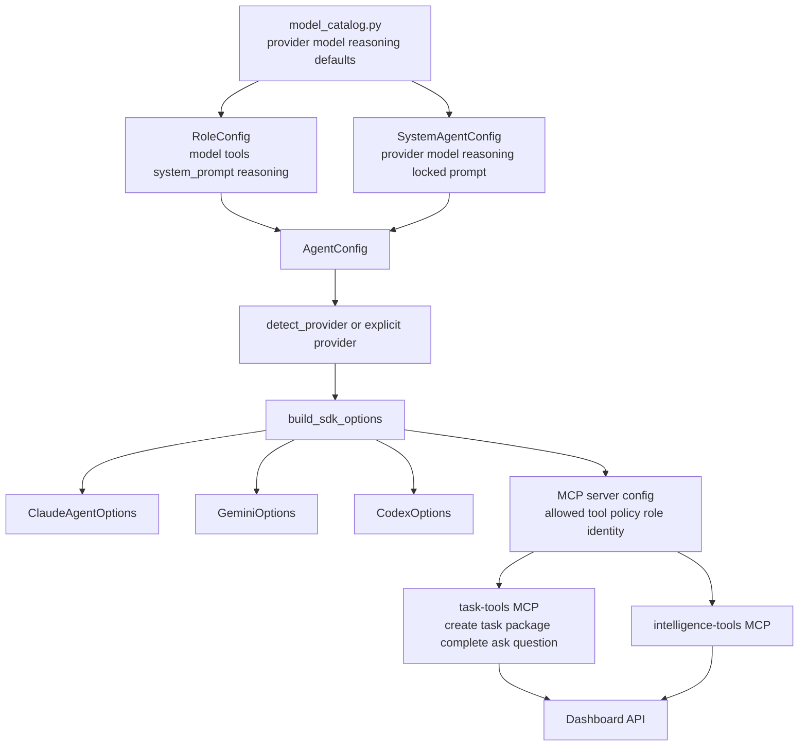

Provider selection is configured per role and separately for the locked
system agent profile. Claude, Gemini, and Codex models have provider-specific
reasoning or thinking options in the model catalog.

---

## 14. Low-Level Module Dependency Map

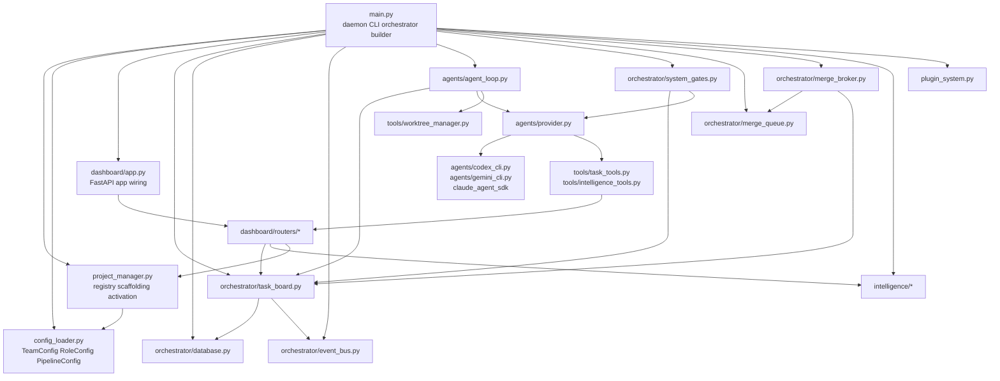

---

## 15. Core Data Model

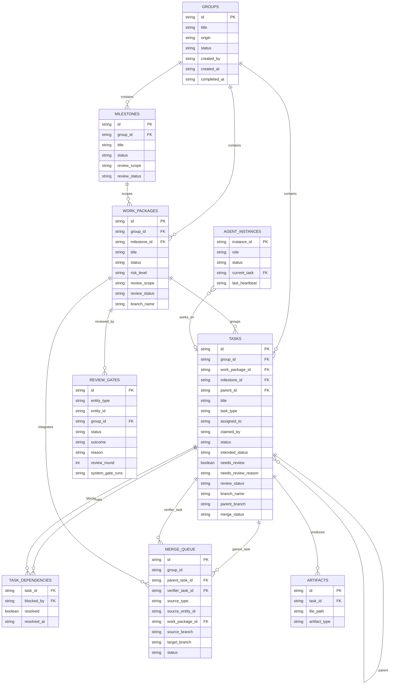

Supporting tables not shown in the core ER diagram include:

- `events`, `task_usage`, `approvals`, `notifications`
- `webhooks`, `webhook_deliveries`
- `agent_questions`, `human_interaction_requests`
- `task_chains`, `first_run_approvals`
- intelligence tables created by v1, v2, and v3 managers
- `id_sequences`, `schema_migrations`

---

## 16. API and Router Surface

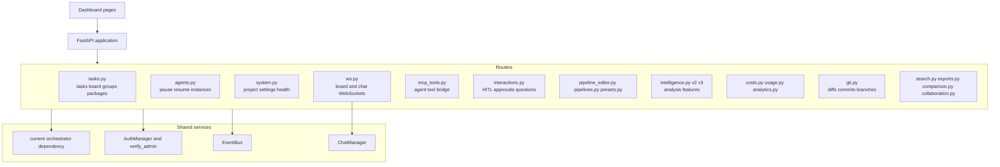

Mutation-heavy routes are protected through middleware plus explicit
`verify_admin` dependencies on critical routers.

---

## 17. Background Worker Responsibilities

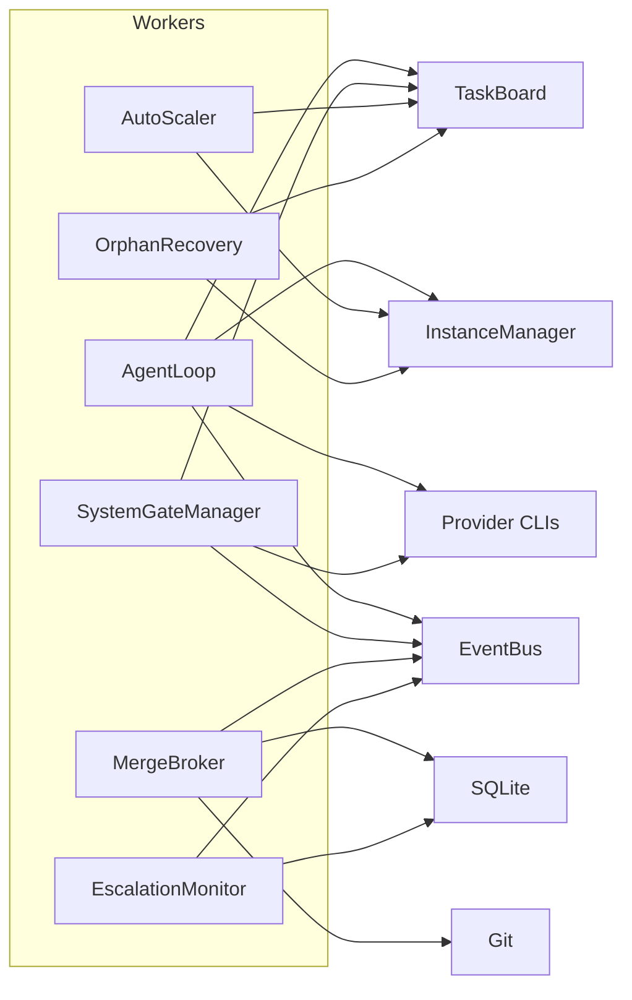

Worker summary:

| Worker | Purpose | Main failure mode handled |
| --- | --- | --- |
| `AgentLoop` | Claims and executes role tasks | retries transient provider errors and fails non-retryable tasks |
| `SystemGateManager` | Runs backlog, task review, and package review gates | retries failed/stale gate runs |
| `MergeBroker` | Serializes branch integration | handles conflicts, leases, stale locks, checkout refresh |
| `AutoScaler` | Adds or removes role instances | scales by queue depth and idle time |
| `OrphanRecovery` | Recovers dead agent work | resets stale `in_progress` tasks and stuck blockers |
| `EscalationMonitor` | Surfaces stuck or risky work | emits escalation events |

---

## 18. Security and Control Boundaries

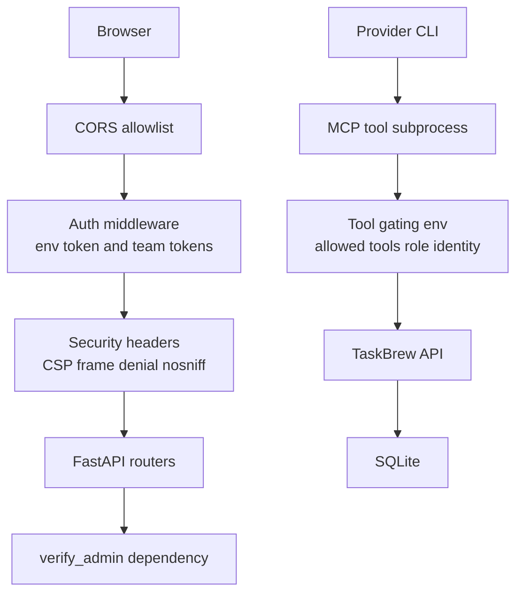

Key boundaries:

- Dashboard mutations are gated by auth middleware and route dependencies.
- WebSockets validate origin and auth through the WebSocket router setup.
- MCP tools receive allowed tool lists and agent role identity through
  environment variables.
- Task tools reject role impersonation when `TASKBREW_AGENT_ROLE` or
  `TASKBREW_AGENT_INSTANCE` is bound.
- File-mutating roles run in isolated worktrees by default.

---

## 19. Configuration Architecture

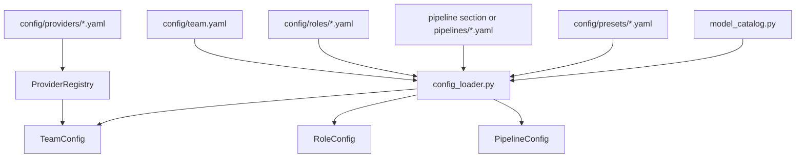

Important defaults:

- Default CLI provider is `codex`.
- Default Codex model for team agents and system agent is `gpt-5.5`.
- Default Codex reasoning effort is `xhigh` for the system profile and
  flagship defaults.
- The system agent prompt is locked in application code, not editable in
  project config.

---

## 20. Deployment and File-System Layout

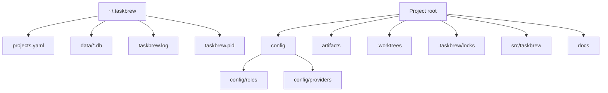

---

## 21. End-to-End Component Interaction Map

```mermaid
flowchart TD
    User["User"]
    UI["Dashboard or CLI"]
    PMgr["ProjectManager"]
    Orch["Orchestrator"]
    Board["TaskBoard"]
    DB["SQLite"]
    Bus["EventBus"]
    WS["WebSocket broadcast"]
    Agents["Agent loops"]
    Provider["Provider adapter"]
    CLIs["Claude Gemini Codex"]
    MCP["MCP tools"]
    Gates["System gates"]
    Packages["Work packages"]
    Merge["Merge queue and broker"]
    Git["Git target branch"]

    User --> UI --> PMgr --> Orch
    Orch --> Board --> DB
    Board --> Bus --> WS --> UI
    Orch --> Agents --> Provider --> CLIs
    CLIs --> MCP --> Board
    Orch --> Gates --> Provider
    Gates --> Board
    Board --> Packages
    Packages --> Merge --> Git
    Merge --> Board
    Merge --> Bus
```

This is the compressed mental model:

1. The user controls projects and goals through dashboard or CLI.
2. The active project owns one orchestrator.
3. The orchestrator owns shared services and background workers.
4. Agents and the system agent mutate the board only through controlled APIs.
5. The task board persists state, emits events, and reconciles dependencies.
6. Work packages define reviewable delivery slices.
7. The merge broker, not provider agents, lands approved branches.
